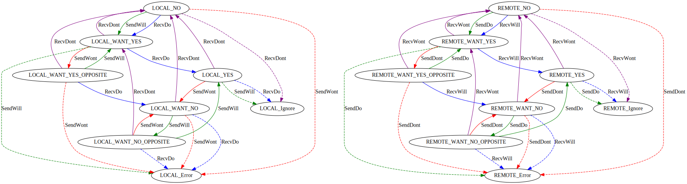

# Telnet Option Negotiation - Q Method

The Q Method of Telnet Option Negotiation is defined in RFC 1143.

This method of option negotiation can best be visualised as a state machine comprising of 6 different states, and 
transitioning between them based on either actions to perform in the local software or messages received from the 
other end of the connection. The State Transition diagram is as follows:

(Receive Positive = Blue, Receive Negative = Purple, Request Positive = Green, Request Negative = Red. Illegal 
messages are dotted lines)

At the beginning of a connection, all options are in the NO state. Options are not considered to be enabled until they 
are in the YES state - anything else is disabled as far as functionality is concerned.

The state transitions in the above diagram are defined in terms of Positive and Negative. This is because the use of 
DO/WILL/DONT/WONT is dependant on which side of the connection the option is considered to be active on. In most cases, 
the Server will be responsible for sending DO and the client will send WILL, but there are a small number of options 
in which the opposite is true. (Echo and Suppress Go Ahead being the primary candidates here).

| Option Active On | Local | Remote |
|------------------|-------|--------|
| Request Positive | WILL  | DO     | 
| Request Negative	| WONT  | DONT   | 
| Receive Positive	| DO    | WILL   | 
| Receive Negative	| DONT  | WONT   | 

A lot of the complexity of this method exists to handle what are relative edge cases in option negotiation, namely 
where the requested state of the option is changing faster than the remote end can respond. However, implementation 
of the state machine is relatively straightforward and means that this case is automatically handled.